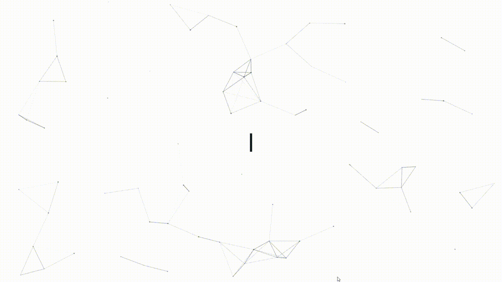

  

---

  

---

📍 Ahmedabad, India

  

&nbsp;&nbsp;&nbsp;

# 💫 About Me

🔭 I’m currently working on *full-stack projects using Django and the MERN Stack.*

👯 I’m looking to collaborate on *Python, Django, MERN Stack and Machine Learning projects.*

🤝 I’m currently strengthening my skills in *advanced React, backend development and deployment.*

🌱 I’m currently learning more about *React.js, Node.js, Express.js, Django, REST APIs and Machine Learning.*

💬 Ask me about *Python, Django, JavaScript, MERN Stack, MongoDB, MySQL, REST APIs and Web Scraping.*

⚡ Fun fact: I enjoy turning *real-world problems into practical software solutions.*

---

# 💻 Tech Stack

### 🧑‍💻 Languages

### 🚀 Frameworks, Platforms & Libraries

### 🗄️ Databases

### 🤖 Data Science & Machine Learning

### 🛠️ Development, Deployment & Tools

---

# 🚀 Featured Projects

## 🌾 Smart Farmer Assistant

*Python • Django • Machine Learning • Deep Learning • APIs • Web Scraping*

A farming-support platform designed to solve practical agricultural problems using web development, machine learning and data-driven features.

### ✨ Highlights

- 🌱 Crop Management
- 🔬 Disease Prediction using Machine Learning
- 🍃 Deep Learning Leaf Scanner using MobileNetV2
- 📷 Webcam and image-upload leaf scanning
- 🌦️ Weather Forecast
- 💰 Market Price Information
- 🧪 Fertilizer Guidance
- 📰 Farming News
- 📊 Analytics Dashboard
- 📄 PDF Reports
- 🌐 Gujarati language support

---

## 🍽️ MongoMeals Restaurant Management System

*MongoDB • Express.js • React.js • Node.js*

A complete MERN-stack restaurant platform with customer functionality, authentication and an administrative dashboard.

### ✨ Highlights

- 🔐 User Authentication with JWT
- 🍱 Menu Management
- 🪑 Restaurant Reservations
- 🎁 Rewards System
- 🎉 Event Management
- ⭐ Customer Reviews
- 👨‍💼 Admin Dashboard
- 📋 CRUD Operations
- 📧 Email functionality
- 🌙 Dark Mode

---

## 🏥 Hospital Management System

*Python • Django*

A hospital management application with patient registration, appointments, medicine suggestions, blood-bank management and administrative operations.

---

## 🍴 Flavors & Fork Restaurant Website

*HTML • CSS • JavaScript • Bootstrap*

A responsive restaurant website featuring menu pages, reservation functionality, gallery, contact pages and responsive Bootstrap design.

---

# 📊 GitHub Analytics

  

> 💡 Language statistics represent the code composition of my GitHub repositories and are not a measurement of my proficiency.

---

# 🐍 Watch My Contributions Come Alive

The snake travels through my GitHub contribution graph — turning my coding activity into a live animation. 🚀

---

# 🏆 Highlight

### 🏆 CAWACH Kendra — State-Level Competition

Uttam Category Winner | 2026

---

# 🤝 Connect With Me

I'm always interested in learning, building meaningful projects and connecting with developers.

 

  

### ✨ Thanks for visiting my profile!

Let's connect, learn and build something meaningful. 🚀

